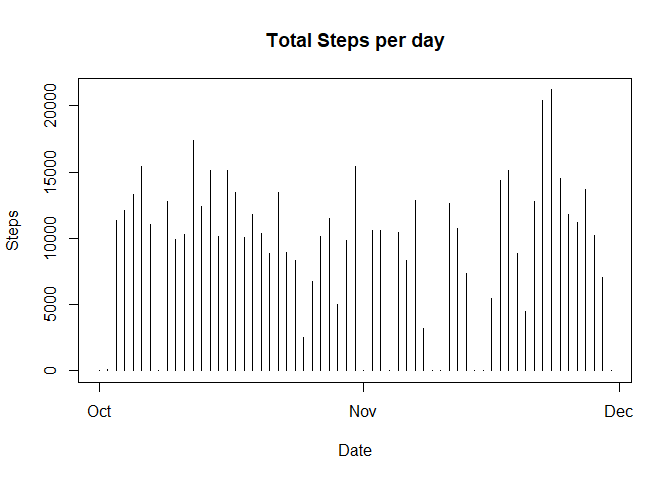
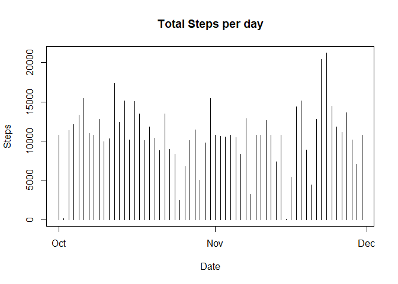

```r
knitr::opts_chunk$set(echo = TRUE)
```

### Mean per day analysis


```r
library(ggplot2)
library(dplyr)
library(xtable)
setwd("C:/Data")
Activity <- data.table::fread("activity.csv", header=TRUE)

#getting mean number of steps
sumstepsperday<-tapply(Activity$steps, Activity$date, sum,na.rm=TRUE)
#this is the total number of steps per day
meanstepsperday<-tapply(Activity$steps, Activity$date, mean,na.rm=TRUE)
#this is the mean number of steps for all days
medianstepsperday<-tapply(Activity$steps, Activity$date, median,na.rm=TRUE)
#this is the median number of steps for all days
daydata<-unique(strptime(Activity$date,"%Y-%m-%d"))

plot(x = daydata, y = sumstepsperday, main = "Total Steps per day", xlab = "Date", ylab = "Steps", type = "h")
```

<!-- -->

```r
Output1<-data.frame(daydata,meanstepsperday,medianstepsperday)
Output1
```

```
##               daydata meanstepsperday medianstepsperday
## 2012-10-01 2012-10-01             NaN                NA
## 2012-10-02 2012-10-02       0.4375000                 0
## 2012-10-03 2012-10-03      39.4166667                 0
## 2012-10-04 2012-10-04      42.0694444                 0
## 2012-10-05 2012-10-05      46.1597222                 0
## 2012-10-06 2012-10-06      53.5416667                 0
## 2012-10-07 2012-10-07      38.2465278                 0
## 2012-10-08 2012-10-08             NaN                NA
## 2012-10-09 2012-10-09      44.4826389                 0
## 2012-10-10 2012-10-10      34.3750000                 0
## 2012-10-11 2012-10-11      35.7777778                 0
## 2012-10-12 2012-10-12      60.3541667                 0
## 2012-10-13 2012-10-13      43.1458333                 0
## 2012-10-14 2012-10-14      52.4236111                 0
## 2012-10-15 2012-10-15      35.2048611                 0
## 2012-10-16 2012-10-16      52.3750000                 0
## 2012-10-17 2012-10-17      46.7083333                 0
## 2012-10-18 2012-10-18      34.9166667                 0
## 2012-10-19 2012-10-19      41.0729167                 0
## 2012-10-20 2012-10-20      36.0937500                 0
## 2012-10-21 2012-10-21      30.6284722                 0
## 2012-10-22 2012-10-22      46.7361111                 0
## 2012-10-23 2012-10-23      30.9652778                 0
## 2012-10-24 2012-10-24      29.0104167                 0
## 2012-10-25 2012-10-25       8.6527778                 0
## 2012-10-26 2012-10-26      23.5347222                 0
## 2012-10-27 2012-10-27      35.1354167                 0
## 2012-10-28 2012-10-28      39.7847222                 0
## 2012-10-29 2012-10-29      17.4236111                 0
## 2012-10-30 2012-10-30      34.0937500                 0
## 2012-10-31 2012-10-31      53.5208333                 0
## 2012-11-01 2012-11-01             NaN                NA
## 2012-11-02 2012-11-02      36.8055556                 0
## 2012-11-03 2012-11-03      36.7048611                 0
## 2012-11-04 2012-11-04             NaN                NA
## 2012-11-05 2012-11-05      36.2465278                 0
## 2012-11-06 2012-11-06      28.9375000                 0
## 2012-11-07 2012-11-07      44.7326389                 0
## 2012-11-08 2012-11-08      11.1770833                 0
## 2012-11-09 2012-11-09             NaN                NA
## 2012-11-10 2012-11-10             NaN                NA
## 2012-11-11 2012-11-11      43.7777778                 0
## 2012-11-12 2012-11-12      37.3784722                 0
## 2012-11-13 2012-11-13      25.4722222                 0
## 2012-11-14 2012-11-14             NaN                NA
## 2012-11-15 2012-11-15       0.1423611                 0
## 2012-11-16 2012-11-16      18.8923611                 0
## 2012-11-17 2012-11-17      49.7881944                 0
## 2012-11-18 2012-11-18      52.4652778                 0
## 2012-11-19 2012-11-19      30.6979167                 0
## 2012-11-20 2012-11-20      15.5277778                 0
## 2012-11-21 2012-11-21      44.3993056                 0
## 2012-11-22 2012-11-22      70.9270833                 0
## 2012-11-23 2012-11-23      73.5902778                 0
## 2012-11-24 2012-11-24      50.2708333                 0
## 2012-11-25 2012-11-25      41.0902778                 0
## 2012-11-26 2012-11-26      38.7569444                 0
## 2012-11-27 2012-11-27      47.3819444                 0
## 2012-11-28 2012-11-28      35.3576389                 0
## 2012-11-29 2012-11-29      24.4687500                 0
## 2012-11-30 2012-11-30             NaN                NA
```

### Daily activity pattern


```r
#getting mean number of steps
Meanstepsperinterval<-tapply(Activity$steps, Activity$interval, mean,na.rm=TRUE)
#this is the Mean number of steps per interval
oneday <- filter(Activity,Activity$date=="2012-10-01")
time <-oneday$interval
plot(time,Meanstepsperinterval,type = "l")
```

<!-- -->

```r
MaxInterval<-which.max(Meanstepsperinterval)
cat("The max number of steps occurs at interval", MaxInterval[[1]], "which corresponds to",Activity$interval[MaxInterval[[1]]] )
```

```
## The max number of steps occurs at interval 104 which corresponds to 835
```
### Handling NA


```r
#getting the number of NA
NAInTheData<-sum(is.na(Activity))
cat("The steps are showing NA values", NAInTheData, "times")
```

```
## The steps are showing NA values 2304 times
```

```r
ActivityNAFilled<-Activity
ActivityNAFilled$AvgSteps<-Meanstepsperinterval
#now replacing each NA with the corresponding average number of steps for the same period for all the data set
ActivityNAFilled$steps[is.na(ActivityNAFilled$steps)]<-ActivityNAFilled$AvgSteps[which(is.na(ActivityNAFilled$steps))]

#getting mean number of steps
sumstepsperday<-tapply(ActivityNAFilled$steps, ActivityNAFilled$date, sum,na.rm=TRUE)
#this is the total number of steps per day
meanstepsperday<-tapply(ActivityNAFilled$steps, ActivityNAFilled$date, mean,na.rm=TRUE)
#this is the mean number of steps for all days
medianstepsperday<-tapply(ActivityNAFilled$steps, ActivityNAFilled$date, median,na.rm=TRUE)
#this is the median number of steps for all days

plot(x = daydata, y = sumstepsperday, main = "Total Steps per day", xlab = "Date", ylab = "Steps", type = "h")
```

<!-- -->
It is clear that both plots are different

### Weekend vs Weekday differences


```r
library(chron)
#now adding a variable with True for a weekend and False for weekday
ActivityNAFilled$DayType<-is.weekend(ActivityNAFilled$date)
WeekdayData<-subset(ActivityNAFilled,ActivityNAFilled$DayType==FALSE)
WeekEndData<-subset(ActivityNAFilled,ActivityNAFilled$DayType==TRUE)
MeanstepsperintervalWeekDay<-tapply(WeekdayData$steps, WeekdayData$interval, mean,na.rm=TRUE)
MeanstepsperintervalWeekEnd<-tapply(WeekEndData$steps, WeekEndData$interval, mean,na.rm=TRUE)

layout(matrix(1:2, ncol = 1), widths = 1.5, heights = c(5,5), respect = FALSE)
par(mar = c(0, 5, 5, 2.1))
plot(time,MeanstepsperintervalWeekDay,type = "l", ylab = "WeekDay")
par(mar = c(5, 5, 0, 2.1))
plot(time,MeanstepsperintervalWeekEnd,type = "l",ylab = "WeekEnd")
```

<!-- -->
